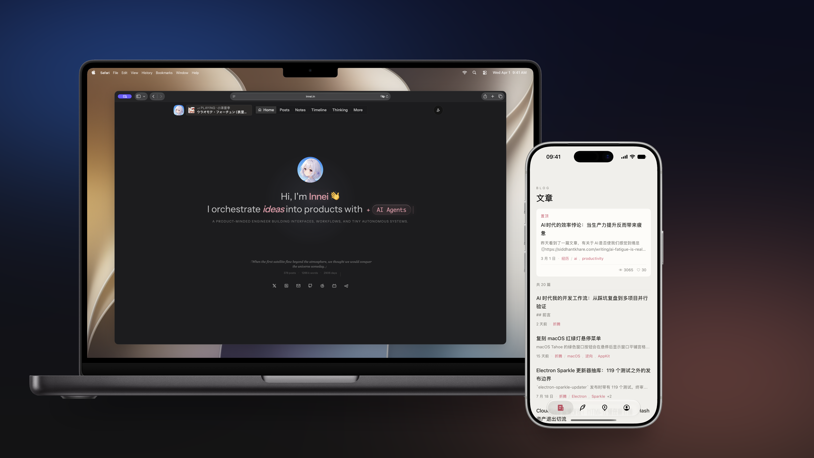

<div align="center">

# 余白 / Yohaku

_留白也是写作的一部分。_

[在线体验](https://innei.in) · [设计系统](https://yohaku.innei.dev) · [iOS 源码](https://github.com/Innei/Yohaku) · [获取 Web 访问权限](https://github.com/sponsors/Innei)

</div>



Yohaku 是一套面向个人写作的跨端出版产品。它以 [mx-core](https://github.com/mx-space/core) 为内容后端，在 Web 与 iOS 上统一呈现文章、手记、思考与时间线；界面退居其后，让文字、节奏与阅读本身成为主角。

完整 Web 产品由早期的开源前端 [Shiro](https://github.com/Innei/Shiro) 演进而来，目前以闭源方式持续开发。iOS 客户端与 Yohaku 设计系统已在 [Innei/Yohaku](https://github.com/Innei/Yohaku) 公开。

> [!IMPORTANT]
> 当前 Web 版本要求 **mx-core v12 或以上**。如需兼容 mx-core v11 及更早版本，请使用 [`721bb617`](https://github.com/Innei-dev/Yohaku/commit/721bb617db0dd1571751dbdf01cc6dfe74defedf)。

## 产品构成

| 层           | 职责                                                   | 开放状态                                                            |
| ------------ | ------------------------------------------------------ | ------------------------------------------------------------------- |
| **Web**      | 响应式个人站、长文阅读与完整内容体验                   | 本仓库闭源维护，线上实例为 [innei.in](https://innei.in)             |
| **iOS**      | 面向单一站点的原生阅读客户端，支持 iOS 18 或以上       | [源码公开](https://github.com/Innei/Yohaku/tree/main/apps/mobile)   |
| **设计系统** | 色彩、字体、间距、动效、模板与 AI Skill 的统一设计契约 | [MIT 开源](https://github.com/Innei/Yohaku/tree/main/design-system) |
| **内容服务** | 内容、评论、鉴权与实时数据                             | 基于 [mx-core](https://github.com/mx-space/core)，要求 v12 或以上   |

## 阅读体验

| 原则           | 表现                                                                           |
| -------------- | ------------------------------------------------------------------------------ |
| **书写优先**   | 文章、手记、思考与时光拥有各自的叙事节奏，而不是被压进同一种信息卡片。         |
| **纸面感**     | 浅色模式接近纸张的暖白，深色模式沉入暖灰；衬线标题与低密度排版为正文保留空间。 |
| **克制交互**   | 单一强调色、三档中性层级与轻量反馈共同降低界面噪声。                           |
| **呼吸式动效** | 内容随阅读进程自然展开；首次进入建立节奏，重复访问不制造额外打扰。             |
| **跨端一致**   | Web 与 iOS 共用内容模型与富文本语义，并分别遵循浏览器与原生平台的交互方式。    |

## 仓库边界

```text
Yohaku
├── apps/web                 完整 Web 产品
├── apps/mobile-overlay      App Store 发行所需的私有站点配置
├── apps/mobile              → 公开 iOS 源码
├── packages/design-system   → 公开设计系统
├── packages/rich-content    → 跨端富文本渲染
└── yohaku-oss               公开源码子模块
```

`apps/mobile` 与公开包通过 `yohaku-oss` 子模块接入。本仓库不会重复维护公开源码，只保留完整 Web 实现及 App Store 发行 overlay。

> [!NOTE]
> Yohaku 与上一代项目 [Shiroi](https://github.com/innei-dev/Shiroi) 已完全分离；两者的仓库访问权限与赞助关系相互独立。

## 本地运行

| 要求    | 版本      |
| ------- | --------- |
| Node.js | 22 或以上 |
| pnpm    | 11.20.0   |
| mx-core | 12 或以上 |

```bash
git submodule update --init --recursive
pnpm install
cp apps/web/.env.template apps/web/.env.local
pnpm dev
```

随后在 `apps/web/.env.local` 中配置 mx-core 的 API 与 Gateway 地址。开发服务器默认运行于 `http://localhost:2323`。

私有服务器的自动部署流程见 [yohaku-deploy-action](https://github.com/innei-dev/yohaku-deploy-action)。

## 获取访问权限

完整 Web 实现继续在 [Innei-dev/Yohaku](https://github.com/Innei-dev/Yohaku) 中维护。通过 [GitHub Sponsors](https://github.com/sponsors/Innei) 完成对应赞助后，请在 [Innei/Yohaku Issues](https://github.com/Innei/Yohaku/issues) 中提交 GitHub 用户名，或通过邮件联系维护者，以便手动开通访问权限。

## 许可

Copyright © 2026 Innei.

本仓库遵循 [MIT License](./LICENSE) 及其[附加条款](./ADDITIONAL_TERMS.md)。公开 iOS 客户端、设计系统与相关包的具体许可，以 [Innei/Yohaku](https://github.com/Innei/Yohaku) 中各目录的许可证文件为准。
