# Minamo Click-Only Unbounded Interference Design

**Date:** 2026-07-10

**Status:** Ready for user review

**Baseline:** Original Minamo implementation restored by `f3220315`

## Summary

Minamo keeps its original caustic material, palette, sparkle, koi shadow,
vignette, and circular click-wave packet. Automatic circular ripples are
removed. Click events retain the original 3.5-second lifetime but are no
longer stored in a six-slot ring buffer or uploaded through one fixed uniform
array.

All unexpired click packets are accumulated into a signed offscreen height
field in multiple bounded batches. The number of batches is dynamic, so the
implementation has no fixed click-event count limit. The final Minamo pass
derives surface slope from the signed height field and uses that slope for
caustic refraction and directional specular lighting. It does not square and
fill the positive half of the summed height field. Consequently, crossing
waves reinforce or cancel locally while their circular fronts continue through
one another instead of merging into capsule-shaped contours.

## Goals

- Remove every automatically scheduled circular ripple.
- Preserve the existing moving caustics, sparkle, koi shadow, hue drift,
  vignette, and seasonal selection.
- Preserve the recognizable two-to-three-crest shape of the original click
  packet.
- Accept every click during the 3.5-second lifetime without a fixed event-count
  cap.
- Keep each wave centered exactly on its click and geometrically circular.
- Add restrained, stable per-click variation.
- Render overlap as signed interference rather than a filled merged contour.
- Preserve WebGL 1 and WebGL 2 behavior.

## Non-goals

- A full Navier–Stokes or GPU height-field simulation.
- Persistent waves beyond 3.5 seconds.
- Elliptical waves, directional wakes, drag interaction, droplets, splash
  crowns, or audio.
- Removing sparkle, koi shadow, caustic animation, or the `density` control.
- Guaranteeing constant frame cost for an arbitrarily high synthetic click
  rate. Events are never dropped, so accumulation work necessarily grows with
  the number of unexpired events.

## Current Failure Modes

### Automatic wave sources

The original fragment shader evaluates three perpetual `ripple()` slots. They
create circular wave packets even when the user has not interacted with the
page.

### Fixed click capacity

The component uses a six-element CPU ring buffer, a `Float32Array(24)`, and
`u_clickRipples[6]`. A seventh click overwrites an earlier event even when that
event has not reached the end of its 3.5-second lifetime.

### Non-physical merged contours

The original shader first sums click and ambient height, then evaluates:

```text
crest = min(max(sumHeight, 0)^2 * 2, 1)
```

This discards the negative half of the field and nonlinearly fills connected
positive regions. Nearby circular packets can therefore appear as a capsule or
rounded rectangle. The artifact is a lighting/composition consequence, not a
water-wave resonance.

## Selected Architecture

### Dynamic active-event list

The CPU stores click events in a dynamic array. Each event contains:

- click position in CSS viewport pixels;
- start time on the Minamo event clock;
- wavelength scale;
- amplitude scale;
- phase offset;
- speed scale derived from the wavelength scale plus a small environmental
  variation.

Every frame removes events whose age is outside `[0, 3.5)`. No other event is
removed, overwritten, or omitted.

### Batched signed-height accumulation

The GPU accumulation shader accepts a small fixed batch of events per draw.
The batch size is an implementation detail, not a global capacity. The CPU
executes as many ping-pong accumulation passes as required to process the
entire active array.

```mermaid
flowchart LR
  A["Pointer down"] --> B["Create circular packet with stable parameters"]
  B --> C["Dynamic active-event list"]
  C --> D["Discard only events aged 3.5 s or more"]
  D --> E["Process all remaining events in bounded batches"]
  E --> F["Signed offscreen height texture"]
  F --> G["Height gradient"]
  G --> H["Caustic refraction and specular lighting"]
  H --> I["Final Minamo composition"]
```



The field texture is lower resolution than the final canvas because the click
packet is spatially smooth. Linear sampling restores a continuous field in the
composition pass.

### Texture formats and fallback

- Prefer a renderable half-float texture when supported.
- Fall back to a ping-pong RGBA8 texture with biased signed encoding and
  per-channel decode scales.
- The RGBA8 path may compress extreme overlapping energy but must not discard
  events or restore a fixed click count.
- If neither accumulation path can create a complete framebuffer, render the
  base Minamo material without click interaction. Do not silently restore the
  six-event implementation.

## Wave Model and Randomness

The spatial packet retains the original Gaussian-windowed sinusoid so its
visual identity remains recognizable. Per-click parameters are generated once
and remain constant for the event lifetime.

| Parameter        |                     Range | Constraint                                                           |
| ---------------- | ------------------------: | -------------------------------------------------------------------- |
| Wavelength scale |               `0.94–1.06` | Uniformly sampled                                                    |
| Amplitude scale  |               `0.90–1.10` | Uniformly sampled                                                    |
| Phase offset     |            `-0.08π–0.08π` | Small enough to preserve immediate response                          |
| Speed scale      | Approximately `0.93–1.07` | Correlated with wavelength, plus at most ±2% environmental variation |
| Lifetime         |                   `3.5 s` | Fixed                                                                |
| Center           |    Exact click coordinate | No jitter                                                            |
| Shape            |                    Circle | No anisotropy or ellipticity                                         |

Random values come from a stable per-click seed. They are not regenerated per
frame.

The correlation between wavelength and speed is an intentionally lightweight
approximation of gravity–capillary dispersion. This design is physically
closer than a rigid identical packet but does not claim to be a complete fluid
simulation.

## Interference and Rendering

For active packets `h_i`, accumulation produces:

```text
h = sum(h_i)
```

Both positive and negative heights remain present. The composition pass samples
neighboring height texels to estimate `∂h/∂x` and `∂h/∂y`, constructs a surface
normal, and applies:

- caustic coordinate refraction from the signed slope;
- a bounded directional specular term from the same normal.

The click field does not enter the original positive-height squared crest path.
It also does not directly paint an opaque or translucent ring. Crossing packets
remain individually circular and pass through one another; only their local
surface height and slope temporarily reinforce or cancel.

## Automatic-Ripple Removal

- Remove `ripple()` and the three-slot ambient loop.
- Do not upload or schedule ambient ripple state.
- Keep the slow caustic clock and real-time event clock.
- Keep `u_density`, because it still controls sparkle probability.
- Keep sparkle and koi scheduling unchanged.

With no active click, the accumulation pass must produce an exactly zero signed
click-height field for any idle duration.

## Component Boundaries

### Interaction helper

A pure helper module owns:

- click-event type and lifetime;
- deterministic parameter generation;
- removal of expired events;
- conversion from the complete active list into fixed-size GPU batches.

The helper must never truncate the active list.

### WebGL renderer

The component owns:

- accumulation texture/framebuffer allocation and cleanup;
- ping-pong batch passes;
- final Minamo composition pass;
- resize and DPR handling;
- shader compile/link diagnostics in development.

### Shader sources

The shader module exports:

- the shared full-screen vertex shader;
- a click-height accumulation fragment shader;
- the final Minamo composition fragment shader.

## Resize and Lifecycle Behavior

- Events remain stored in CSS coordinates, as in the baseline.
- Resize reallocates field textures but does not move click centers.
- Active events are re-evaluated into the newly allocated field on the next
  frame.
- WebGL resources are deleted on unmount.
- Context loss retains the existing transparent/base fallback behavior; full
  context restoration is out of scope.

## Verification

### Behavioral tests

- Generate deterministic parameters from a fixed seed.
- Verify every parameter remains inside its approved range.
- Verify packet center and circular geometry are never randomized.
- Provide more than six unexpired events and verify all are included in output
  batches.
- Verify events remain active before 3.5 seconds and are removed at or after
  3.5 seconds.
- Verify batch boundaries do not change event order or parameter values.

### Shader and runtime verification

- Compile and link the accumulation and composition programs in WebGL 2.
- Force WebGL 1 and verify its accumulation path.
- Verify an idle period of at least 10 seconds produces no circular ripple.
- Trigger 8, 16, and 32 rapid clicks and verify no event is overwritten or
  omitted.
- Verify center, edge, and corner clicks remain coordinate-aligned at DPR 1 and
  DPR 2.
- Resize while events are active and verify their centers remain stable.

### Visual verification

- Verify every isolated packet remains circular.
- Verify consecutive packets visibly vary without appearing unrelated.
- Verify crossing packets pass through one another.
- Verify crest–crest crossings strengthen locally and crest–trough crossings
  weaken locally.
- Verify no capsule, rounded-rectangle, or filled merged contour appears.
- Verify click response is fully absent after 3.5 seconds.
- Verify base caustics, sparkle, koi shadow, palette, and vignette remain
  visually unchanged when no click is active.

### Performance verification

- Compare idle, 1-click, 8-click, 16-click, and 32-click frame timings.
- Measure at 1440p CSS / DPR 2 and 4K CSS / DPR 2.
- The implementation may degrade proportionally under synthetic click floods,
  but it must not discard events or introduce a fixed global capacity.

## Expected File Changes

- `apps/web/src/components/ui/background/MinamoBackground.shader.ts`
  - remove the ambient ripple path;
  - add signed-height accumulation and slope-based composition shaders;
  - remove click use of positive-height squared crest filling.
- `apps/web/src/components/ui/background/MinamoBackground.tsx`
  - replace the six-slot ring buffer with a dynamic active list;
  - add accumulation framebuffer lifecycle and batched passes.
- `apps/web/src/components/ui/background/MinamoBackground.interaction.ts`
  - add pure event, randomness, expiry, and batching helpers.
- `apps/web/src/components/ui/background/MinamoBackground.interaction.test.ts`
  - add behavior-oriented tests for ranges, lifetime, and unbounded batching.

## Acceptance Criteria

- Minamo produces no automatic circular ripple.
- Caustics, sparkle, koi shadow, palette, vignette, and density-controlled
  sparkle remain.
- All unexpired clicks are rendered, including counts greater than six.
- Click events expire at 3.5 seconds.
- Wave centers remain exact and wavefronts remain circular.
- Per-click variation remains within the approved ranges and is stable for the
  event lifetime.
- Overlapping packets reinforce and cancel through signed height and slope.
- No positive-height squared click fill or capsule-shaped merged contour
  remains.
- WebGL 1 and WebGL 2 both render the click-only design.
