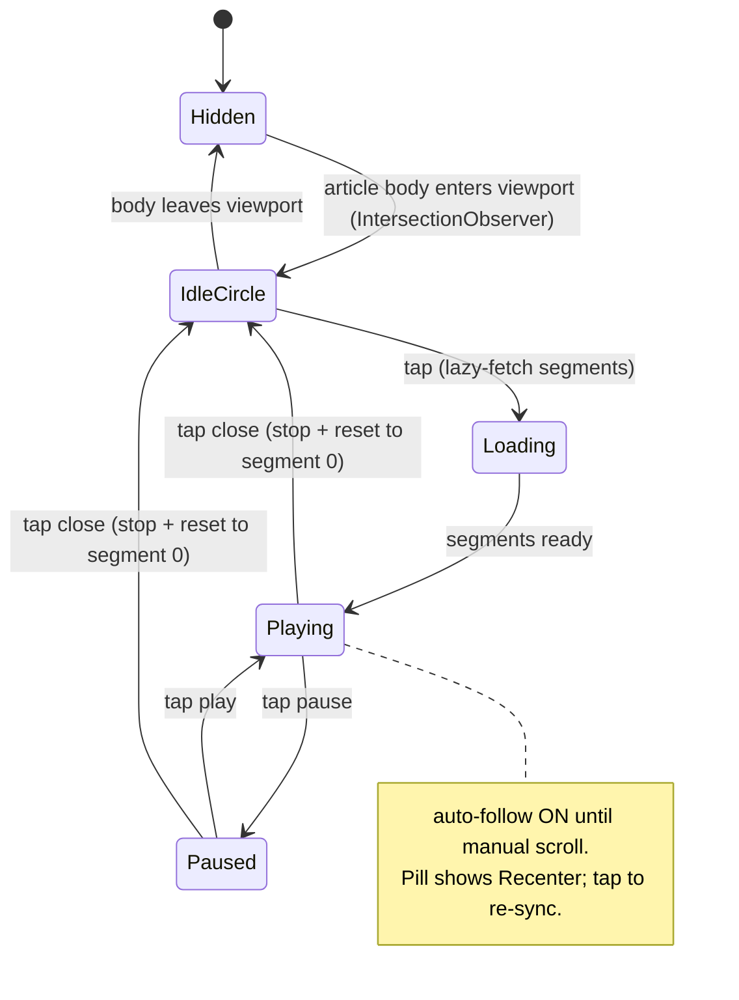

# TTS Narration UI Redesign — Design

Date: 2026-08-08
Status: Approved (brainstorm mockups: `.superpowers/brainstorm/58755-1786165636/content/`)
Affects: `apps/web/src/components/modules/tts/`, `apps/web/src/components/layout/header/internal/MobileHeader.tsx`

## Problem

The current TTS UI (`TtsArticleProvider.tsx`) renders a **fixed horizontal bar above the article content** — accent play/pause circle, "Narration" label, stale warning, a speed cycle button, a segment counter (`1/12`), and a stop button. For a 余白 ("less is more") blog it has three problems:

1. **Occupies above-content space at rest.** The strip is present before the reader ever listens, consuming vertical real estate with a label + button many readers will never use.
2. **Scrolls away.** Once the reader scrolls into the body, every playback control is gone. There is no persistent surface while reading.
3. **Reflows on playback.** Speed, segment counter, and stop button pop in conditionally as playback starts, so the bar changes shape.

There is no within-segment progress (only a segment index), and the highlight bar unconditionally hijacks scroll (`scrollIntoView` on every segment change), fighting a reader who wants to skim or linger.

## Decision

Split the surface by viewport:

- **Desktop (≥ `lg`)**: replace the top bar with a **floating pill** anchored bottom-right. A quiet neutral play circle fades in only once the article body is in the viewport; tapping lazy-activates and expands it into a minimal transport pill. The pill persists while playing/paused and vanishes on stop.
- **Mobile (`< lg`)**: do **not** add a floating element. Integrate narration into the existing **bottom-floating capsule header** (`CapsuleHeader`) as a new "narrating" state, reusing the same ticket/panel/dot machinery the Live Desk activity already uses.
- Both viewports keep the per-block gutter play buttons, the lazy activation/fetch flow, the gapless segment playback engine, and `toast.error` on failure.

Accent appears **only while narrating**. At rest a non-listening reader sees zero accent — reinforcing "accent = active narration" and keeping coverage far under the 5% rule.

## Design decisions (with rationale)

| # | Decision | Chosen over | Why |
|---|----------|-------------|-----|
| 1 | Desktop control surface = floating pill (FAB), bottom-right | top-of-article bar · sticky bottom dock · inline/margin-traveling | Exists only while narrating; vanishes at rest → most 余白-faithful. Does not consume above-content space. |
| 2 | Idle reveal = on scroll-in (article body enters viewport) | always-on circle · entry-point-triggered · one-time suggest | Silent at the hero/header and past the article; a quiet circle appears only when the reader is actually in the body. |
| 3 | Expanded form = minimal transport, no scrubber (V1) | pill-with-scrubber · pop-out player card | Pure transport: play/pause · elapsed · segment · speed · close. Consistent with the restraint choice; scrubbing is not a narration behavior. |
| 4 | Auto-scroll = follow, yield on manual scroll | always-follow · never-scroll | Immersive read-along until the reader scrolls, then stops hijacking; a Recenter affordance re-syncs. |
| 5 | Mobile = capsule "narrating" state (ticket + `tts` panel + dot) | floating pill on mobile · generic top-bar icon | Reuses the capsule's existing Live Desk pattern; no new bottom-corner object to collide with the TocFAB; the sticky capsule never scrolls away. |
| 6 | Mobile discovery = menu entry ("朗读") | idle-capsule ▶ affordance | Keeps the idle capsule pure (site title only); avoids adding visual weight to the resting state. |
| 7 | Per-block gutter buttons retained | — | Hover-revealed (hidden at rest = 余白-clean); with no scrubber they are the only block-jump affordance. |
| 8 | Close = stop + reset to segment 0 | remember position | Narration is linear; resume adds state for negligible gain. |

## Desktop — floating pill

### Lifecycle

The element has two forms driven by state: a **quiet idle circle** (discovery) and an **expanded transport pill** (playback). The pill persists across the viewport regardless of scroll while playing or paused — it *is* the playback control, so it cannot scroll away. `Close (✕)` stops playback, resets position to segment 0, and collapses back to the idle circle.

- **Hidden**: not rendered. Initial state, and whenever the main article content is outside the viewport.
- **IdleCircle**: a small neutral play circle, bottom-right, faded in. Tapping lazy-activates (`activated = true`, react-query fetch with existing `staleTime: 5 * 60 * 1000`) and transitions to Loading.
- **Loading**: the circle node becomes a spinner (`i-mingcute-loading-3-line animate-spin`). On data ready → expand to pill and begin playback.
- **Playing / Paused**: the pill. Play/pause toggles playback; playback engine's segment sequencing + next-segment preload are unchanged.
- **Stale content** (`ttsMeta.stale`): a `size-1.5` dot, `bg-warning` (kuchiba), at the top-right of the idle circle. In the pill, a tiny stale marker replaces the legacy amber text line.
- **Errors**: `toast.error(t('error'))`, unchanged.

### Expanded pill contents

A single pill row, left-to-right:

1. **Play/pause** — `bg-accent text-white size-8 rounded-full`. The *same node* as the idle circle (shared `layoutId="tts-fab"`), so accent fades in exactly as narration starts.
2. **Elapsed · segment** — `text-xs tabular-nums text-neutral-7` → `2:14 · 1/12`.
3. **Speed** — `text-xs tabular-nums text-neutral-7 hover:text-neutral-9`, cycles `[1, 1.25, 1.5, 1.75, 2]`.
4. **Recenter** — conditional, only when `autoFollow === false` (reader scrolled manually). `i-mingcute-aim-line` (or `locate-line`), `text-neutral-7` accent-tinted. Tapping sets `autoFollow = true` and immediately re-syncs scroll to the narrated block.
5. **Close (✕)** — `i-mingcute-close-line text-neutral-7 hover:text-neutral-9`. Stop + reset.

No seek bar, no within-segment scrubber.

### Visual spec (token-compliant per `DESIGN.md`)

- **Idle circle**: `size-11 rounded-full`, `bg-paper ring-1 ring-border`, whisper shadow `shadow-[0_4px_24px_rgba(0,0,0,0.05)]`. Play icon `text-neutral-7` → `text-neutral-9` on hover. Neutral on purpose (no accent at rest).
- **Pill**: `h-11 rounded-full`, surface `bg-paper/85` + `.uk-material-default` (the sanctioned glass material — not ad-hoc `backdrop-blur`, which §10 bans on popovers) + `ring-1 ring-border` + whisper shadow. Padding `px-2`.
- **Accent**: only the active play/pause node. Idle circle and all secondary controls are neutral.
- **Position**: `position: fixed`, bottom-right, `right-[max(0px,env(safe-area-inset-right))]`, `bottom-[2rem]` desktop. `z-[10]` (above the mobile-only `FABContainer`'s `z-[9]`). Rendered via `RootPortal` to escape the Paper/article transforms.

### Motion (from `constants/spring.ts` / existing transition views)

- **Scroll-in reveal**: fade + 4px slide-up, `softSpringPreset`. `prefers-reduced-motion` → instant.
- **Circle↔pill morph**: shared `layoutId="tts-fab"`, `microReboundPreset`; pill contents stagger in ~30ms.
- **Recenter appear**: `microReboundPreset` scale + opacity.
- **Highlight bar spring** (`TtsHighlightBar`): unchanged — `stiffness 350, damping 32, mass 0.6`.

### Auto-follow (yield on manual scroll)

The highlight bar keeps drawing the active-block highlight regardless of follow state; only the programmatic scroll is gated.

- `autoFollow` boolean, default `true`. On each `playingIndex` change, call `scrollIntoView({ block: 'center', behavior: 'smooth' })` only when `autoFollow === true`.
- A manual-scroll detector flips `autoFollow = false`. Implementation uses a programmatic-scroll guard ref: set the ref before `scrollIntoView`, clear it on `scrollend` (or a `~400ms` timeout fallback). Any wheel/touch/scroll event arriving while the guard ref is clear is treated as manual → `autoFollow = false`.
- The pill's **Recenter** button sets `autoFollow = true` and re-runs the scroll-sync for the current block.
- Reduced-motion: `scrollIntoView` uses `behavior: 'auto'`.

## Mobile — capsule integration

The mobile "header" is the **bottom-floating capsule** (`CapsuleHeader` in `MobileHeader.tsx`): `fixed inset-x-3.5`, `bottom: max(0.875rem, env(safe-area-inset-bottom))`, a state machine `CapsuleVisualState = dot | idle | ticket | expanded | lang | menu` driven by `resolveCapsuleState`. The primary area shows the serif site title or the Live Desk `CapsuleTicketRow`; the right button (`w-12`) is the menu/drawer toggle; scrolling past `COLLAPSE_SCROLL_THRESHOLD` (160px) collapses it to a `dot`. There is **no spare icon slot**, so TTS cannot be "another icon in a row" — it integrates as a new capsule state, isomorphic to Live Desk.

### New capsule concern: narration

Extend `CapsuleVisualState` and `PanelKind` to include a narrating mode:

| State | Trigger | Capsule form | Contents |
|---|---|---|---|
| `narrating` (idle-row) | TTS playing, capsule not collapsed | centered, `ticket`-like width (~92%) | primary area shows the **narrating ticket row** (see below); menu button unchanged. Site title yields while playing. |
| `tts` panel | tap the narrating ticket row | blooms upward like `expanded`/`menu` | play/pause (accent), elapsed · block, thin segment progress, speed, stop (✕). Same panel machinery as `expanded`/`lang`/`menu`. |
| `dot` (narrating) | scroll down past 160px while playing | 44px circle docked bottom-left (`left:0`) | accent playing pulse (analogous to `CapsuleLiveDot`); tap → restore to `narrating` row. |

**Narrating ticket row** mirrors `CapsuleTicketRow`: an accent `▶` glyph + `正在朗读 · {current}/{total} · {elapsed}` in the primary area (`flex-1`), where the site title normally sits. Tap → opens the `tts` panel (`overlay = 'tts'`). The existing primary-button handler (`overlayOnPrimaryTap`) gains a narration branch: when narrating and `overlay === 'none'`, primary tap opens the `tts` panel instead of menu/expanded.

### Discovery (first play)

Mobile has no floating idle circle. The entry point is a **"朗读" (Narration) item in `MobileDrawerContent`** (the menu). Selecting it:

1. If `!available` → no-op (item hidden when TTS unavailable).
2. Lazy-activates and begins playback (`activated = true` → fetch → `playAll()`), reusing the existing activation flow.
3. The capsule reflects the new narrating state; the menu closes (existing route/overlay-close behavior).

The idle capsule stays pure — site title only, no TTS affordance.

### Precedence (narration vs Live Desk)

Both narration and Live Desk are "live activities" competing for the ticket/expanded slot. Rule: **foreground user-initiated audio wins.** While narrating, the capsule shows the narrating ticket row; the Live Desk ticket is suppressed (not rendered in the row) until playback stops. If Live Desk data is present when narration stops, the capsule returns to the `ticket` state; otherwise `idle`. The two expanded panels (`tts` and Live Desk `expanded`) are mutually exclusive — opening one closes the other, identical to the existing `4 and 5 are mutually exclusive` rule.

### Lifecycle interactions

- Scroll down while narrating → `dot` with accent pulse; scroll up/stop → restore to `narrating` row (reuse `useCapsuleCollapsed` + `resolveScrollAction`, inverted-for-bottom behavior already in place).
- Narration ends naturally (last segment `ended`) → capsule returns to `idle` (or `ticket` if Live Desk active), `dot` if still scrolled.
- `tts` panel closes on: ✕ stop, outside tap (existing scrim `onClick={closeOverlay}`), Escape, route change (`setOverlay('none')` on pathname change — existing).
- Keyboard/visual-viewport: capsule already hides when the on-screen keyboard opens (`useKeyboardHidden`); narration continues audibly, controls restore when the keyboard closes.
- The mobile-only `FABContainer` (TocFAB) is unaffected — it remains bottom-right and hide-on-scroll-down; the capsule is bottom-center, no collision.

## Shared playback engine changes

`use-tts-playback.ts` — **extended, not rewritten**. The segment-sequencing + next-segment preload core (the last four commits) stays intact. Add only:

- `currentTime: number` (seconds) and `duration: number` (seconds) for the active segment, sourced from `timeupdate` and `loadedmetadata` listeners on the existing `Audio()`. Both surfaces format these to `mm:ss` via a shared helper.
- `reset()` — stop + set `playingIndex = null` + reset audio `currentTime` to 0, so `Close` returns to segment 0 on next play (decision #8).

`tts-playback-context.tsx` — add `currentTime`, `duration`, `reset` to `TtsPlaybackContextValue` so both the desktop pill and the mobile capsule panel consume the same shape.

`TtsBlockAction.tsx` — **unchanged**. The per-block gutter button keeps working on both viewports (the gutter exists in the article body regardless of the control surface).

## Architecture

Desktop (new + modified):

- **NEW `TtsFloatingPlayer.tsx`** (`'use client'`) — consumes `useTtsPlaybackContext`; renders the idle circle + pill via `RootPortal` (fixed bottom-right). Owns the `IntersectionObserver` scroll-in reveal, the circle↔pill morph (`layoutId`), and the Recenter/auto-follow control surface (the `autoFollow` flag itself lives with the highlight bar, see below). Renders **only when `!isMobile`**.
- **MODIFIED `TtsArticleProvider.tsx`** — remove the top bar markup (the `
` block and its children). Keep activation, fetch, contexts, `BlockGutterActionProvider`, and `{children}`. Mount `<TtsFloatingPlayer />` (desktop) inside the provider tree.
- **MODIFIED `TtsHighlightBar.tsx`** — add the `autoFollow` flag + manual-scroll guard ref; gate `scrollIntoView` on `autoFollow`. Expose a `recenter()` (or lift `autoFollow` into the provider so both the bar and the pill/panel can read/set it). The highlight draw itself is unaffected.
- **MODIFIED `use-tts-playback.ts`** — `currentTime`/`duration`/`reset` as above.

Mobile (modified, all inside `components/layout/header/internal/`):

- **MODIFIED `MobileHeader.tsx` / `CapsuleHeader`** — add an `isNarrating` input to `resolveCapsuleState` that repurposes the `ticket` visual (same ~92% width/shape) for the narrating row, a `'tts'` `PanelKind`, and the narrating ticket row + `tts` panel content. Reads narration state from the shared `ttsNarrationAtom` (see Cross-cutting) — **not** from `TtsPlaybackProvider` — so the global header tree does not depend on the article provider's context. The primary-button handler gains a narration branch: when narrating and `overlay === 'none'`, primary tap opens the `tts` panel.
- **MODIFIED `MobileDrawerContent.tsx`** — add the "朗读" entry (visible only when `ttsMeta.available`); selecting it dispatches a start-narration action on `ttsNarrationAtom` (lazy-activate → fetch → `playAll()`).
- **NEW small components** — `CapsuleNarratingTicketRow` (mirrors `CapsuleTicketRow`) and the `tts` panel body, following the existing capsule file layout.

Cross-cutting:

- A `ttsNarrationAtom` (Jotai) — the single source of truth for "is narration active + progress", written by `TtsArticleProvider`/`useTtsPlayback` and read by both `TtsFloatingPlayer` (desktop) and `CapsuleHeader` (mobile). This keeps the two surfaces decoupled from each other and from the article provider's render tree.

## Edge cases

- **TTS unavailable** (`!ttsMeta.available`): desktop renders nothing (no circle); mobile menu hides the "朗读" entry. Provider already short-circuits to `{children}`.
- **Fetch error**: `toast.error`; desktop circle returns to idle; mobile capsule returns to idle. No partial state.
- **Slow network / long load**: the Loading spinner persists; the circle/pill must not accept a second activation that double-fires the query (react-query dedupes; `handlePlay` already guards `ttsQuery.isLoading`).
- **Reader scrolls past article into comments/footer while playing**: desktop pill persists (it is fixed); the IntersectionObserver gates only the *idle circle* reveal, not the playing pill. Mobile capsule persists (it is fixed).
- **Narration active on route change**: stop playback + reset (segments are per-article). Existing `useEffect` swapping `urls` already stops on change; ensure `reset()` runs too.
- **Live Desk + narration both active**: narration wins the ticket slot (precedence rule above).
- **Reduced motion**: scroll-in reveal instant; `scrollIntoView` uses `behavior: 'auto'`; circle↔pill morph degrades to opacity.
- **Mobile keyboard open**: capsule hides (existing `useKeyboardHidden`); audio continues.
- **`prefers-reduced-data` / no audio autoplay**: the first tap is a user gesture, so `audio.play()` is unlocked; no change needed.

## Token / style compliance (`DESIGN.md`)

- Accent only on the active play/pause node; ≤ 5% surface coverage.
- Neutral scale only: idle circle and secondary controls use `text-neutral-7`/`bg-paper`/`ring-border`. No Tailwind default `neutral-50…950`.
- No `shadow-lg/xl/2xl`; whisper shadow + `.uk-material-default` only.
- `rounded-full` on circle/pill (within the `rounded-2xl` cap).
- No `dark:` overrides on neutral text (auto-inverting tokens).
- Speed cycle + tabular-nums for numeric readouts.

## Testing

- **Unit (Vitest)**: `autoFollow` state machine — defaults true, manual-scroll → false, recenter → true, programmatic-scroll guard prevents false negatives. Playback hook: `currentTime`/`duration` update on `timeupdate`/`loadedmetadata`; `reset()` clears position.
- **Mobile capsule resolve**: narrating branch precedence over Live Desk; `dot` restore target returns to `narrating` while playing.
- **Existing tests stay green**. Any new i18n keys (`tts.narrating`, menu "朗读" label) land in all locales; run `messages/message-usage.test.ts`.
- **Manual (verify skill)**: desktop — scroll-in reveal, tap→expand→play, yield-on-scroll + recenter, close resets; mobile — menu entry starts playback, capsule ticket/panel/dot states, Live Desk precedence, route change stops.

## Out of scope

- Within-segment seek bar / scrubber (explicitly rejected — decision #3).
- "Resume from last position" (rejected — decision #8).
- Backend / TTS generation changes; new segments or voices.
- Desktop header changes.
- Changes to the gapless playback / preload engine internals beyond exposing `currentTime`/`duration`/`reset`.
